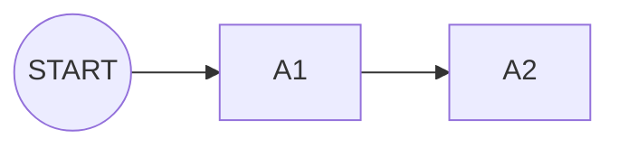

## 1. 目的（単一真実源）
- A/B/C 各層およびトラックごとの**学習モジュール依存関係**を一元管理する。
- ゲート基準（DOC-02）・リンクマトリクス（DOC-04）・モジュールカード（DOC-05）へ参照される「単一の真実」を提供する。
- コホート運営時の**順序変更・モジュール追加**を、教育設計チーム内で即時共有できる状態に保つ。

## 2. 表記ルール（ノード/エッジ/番兵）
- **ノードID**：`A2`, `D3`, `Q2` のように、レイヤ記号＋番号で表記。`START`/`OUT` は番兵ノード。
- **サブグラフ**：Mermaid の `subgraph` を利用し、`A`（共通必修）、`BOPS`（B層 OPS）、`C`（スケール）等で括る。
- **エッジ種別**：すべて**有向エッジ**で、上流モジュール → 下流モジュール。例：`A2` → `O1`。
- **ゲートとの対応**：
  - `START` → A層 → `Gate-A` 相当モジュール群 → B層 → キャップストーン → `OUT`。
  - C層は `Scale Gate` 通過者のみ参照するため、B層ノードから選抜的にエッジを伸ばす。
- **命名更新**：モジュール名を変更する際は、`nodes.csv` → `dag.mmd` → 関連カード（DOC-05）の順で統一する。

## 3. Mermaidコード（`dag.mmd` 参照）
- 図本体は `docs/03_course-dag/dag.mmd` に格納。Mermaid対応エディタ/プレビューで描画する。
- CLI で確認する場合は、[Mermaid CLI](https://github.com/mermaid-js/mermaid-cli) を利用し `mmdc -i dag.mmd -o dag.svg` などで出力すると便利。
- 2025-09-24 時点の構成：**35 ノード / 63 エッジ**。

## 4. 入辺/出辺一覧（`nodes.csv` / `edges.csv`）
- `nodes.csv`：`id,title,layer,track` の列構成。レイヤ（A/B/C/Capstone）と担当トラックを明示。
- `edges.csv`：`from,to,type` の列構成。`type` は `prerequisite` / `feeds` / `enables` / `completion` を使用し、可視化時の凡例に利用する。
- 代表抜粋：

| id | title | layer | track |
|----|-------|-------|-------|
| A2 | CLI と Logs | A | common |
| D3 | Backend 基礎 (TS+Express) | B | dev |
| O2 | 監視/可観測性の読み方 | B | ops |
| XDEV | C-DEV Mini CRM | Capstone | dev |

| from | to | type |
|------|----|------|
| A2 | O1 | prerequisite |
| A2 | Q1 | prerequisite |
| D3 | D5 | prerequisite |
| O2 | C1 | enables |

- `link-matrix.csv`（DOC-04）では、この DAG に沿って上流/下流の整合を取る。

## 5. 更新手順（新規モジュール追加時）
1. **要件確認**：新モジュールの目的・到達目標・ロールを整理し、DOC-02/DOC-05 への影響を明確化。
2. **DAG更新**：
   - `nodes.csv` に新ノードを追記（`layer`,`track` を忘れずに）。
   - `edges.csv` に依存関係を追加。
   - `dag.mmd` に該当ノード/エッジを追記し、サブグラフ内配置を調整。
3. **検証**：`python3 tools/validate_dag.py` を実行し、重複・未定義・循環がないことを確認。
4. **連携更新**：
   - DOC-05 モジュールカードを新規追加/更新。
   - DOC-04 `link-matrix.csv` に上流/下流情報を追記。
   - 必要に応じて DOC-06 ルーブリックや DOC-07 KPI の参照を更新。
5. **記録**：`docs/DOC-INDEX.md` と `CHANGELOG.md` に更新日・概要を記載し、講師/運営へ共有。

---
**上流**：[DOC-02](../02_product-curriculum/DOC-02_プロダクトとカリキュラム体系_v1.0.md)  
**下流**：[DOC-04](../04_link-matrix/DOC-04_リンクマトリクス_v1.0.md), [DOC-05](../05_module-cards/README.md), [DOC-06](../06_assessment-rubric/DOC-06_評価とルーブリック_v1.0.md)
