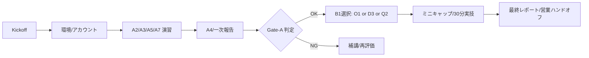

## 1. 目的/成功基準（KPI/判定）
**目的**：4週間で「学習→証跡→配属準備」の再現性を実演し、本導入の意思決定材料を提供する。

**PoC成功判定（組織レベル）**
- 受講率（出席/アクセス） **≥ 85%**
- 課題完了率（割当に対し） **≥ 80%**
- ミニ・キャップストーン合格（ルーブリック） **≥ 70/100**
- **営業ハンドオフ条件** 合意（§9）

**参加者レベルの判定（Gate連動）**
- **Gate‑A（配属準備）**：A小テスト合計 **≥70点** / A2実技 **合格** / A5手順書 **合格** / A課題 **完了≥80%**
- **Gate‑B‑Light（職能到達の簡易版）**：Week4 実技30分 **合格**（トラック別ミニ仕様）

> KPIの定義・集計列は本PoC内で暫定運用し、DOC‑07/19 で本導入版に確定する。

---

## 2. スコープ/対象/前提
- **対象**：10–20名（未経験〜初級）、1社1コホート
- **スコープ**：A圧縮（A2/A3/A4/A5/A7）＋ **Bトラック1モジュールのみ**（OPS=O1 / DEV=D3 / QA=Q2 のいずれか）
- **前提**：LMS/リポジトリ/テンプレ（DOC‑15）利用、社内アカウント払い出し完了

---

## 3. 成果物（証跡）と保管
| 種別 | 必須成果物 | テンプレ/規格 | 保管場所 |
|---|---|---|---|
| ログ抽出 | `log_digest.sh`, `result.csv` | Runbook/一次報告（DOC‑15） | 受講リポ `evidence/a2_logs/` |
| PR/レビュー | PRスレッド, リリースノート | PRテンプレ（DOC‑15） | GitHub/PR |
| 手順書 | `runbook_snippet.md` | Runbook（DOC‑15） | `evidence/a5_docs/` |
| QA資産 | 観点表, 欠陥票, Newmanレポ | 欠陥票/PR（DOC‑15） | `evidence/qa/` |
| DEV資産 | API仕様/Postman, CRUD実装, CIログ | PR/README（DOC‑15） | `evidence/dev/` |
| 週次報告 | 進捗/KPIサマリ | 一次報告（DOC‑15） | `reports/week_*/` |

---

## 4. 週次計画（4週間）
| 週 | 目標 | 範囲 | 具体タスク | 提出物 | 評価/判定 |
|---|---|---|---|---|---|
| **W1** | 基礎装着/環境整備 | **A2/A3/A5/A7** | CLIでログ抽出/整形、PR作成とレビュー、手順書ドラフト、AI方針確認 | `log_digest.sh`/`result.csv`、PR、`runbook_snippet.md` | A小テスト①、PRレビュー（R-DEV-CRUDの一部観点） |
| **W2** | 切り分け/一次報告 | **A4/A5** | NW/HTTPの一次切り分け（ping/traceroute/http）、一次報告作成 | 一次報告、NW確認結果 | **Gate‑A 判定**（A合計≥70/実技合格/完了≥80%） |
| **W3** | 職能装着ミニ | **B1モジュール選択**（OPS=**O1** / DEV=**D3** / QA=**Q2**） | OPS: `systemctl/journalctl`演習 / DEV: CRUD+ログ規約 / QA: 欠陥票+Newman | Runbook v0.9 **or** CRUD初版 **or** 欠陥票+レポ | 中間レビュー（ルーブリック該当部） |
| **W4** | ミニ・キャップ | **XOPS or XDEV or XQA（ミニ版）** | OPS: 障害演習→Runbook更新 / DEV: MiniCRM最小要件 / QA: 回帰実行とレポ配信 | 発表資料, 成果物一式 | **30分実技** 合格＋ミニキャップ **≥70/100** |

> Bモジュールは顧客案件に合わせて **OPS/DEV/QA から1つ**選定。FIELD/PMOはPoC範囲外（本導入で対応）。

---

## 5. 評価/ルーブリック/配点
- **100点法（PoCミニ）**：知識15 / 実技35 / 文書20 / チーム適応10 / ミニキャップ20（DOC‑06と整合）
- **30分実技**：OPS=一次切り分け、DEV=CRUD+例外/ログ、QA=観点→欠陥記録→Newman
- **ルーブリック**：`R-OPS-CLI`, `R-DEV-CRUD`, `R-OPS-MON`（DOC‑06/`rubrics/`）  
- **合格閾値**：個人 **≥70/100**、コホート合格＝**合格者比率≥70%** かつ 組織KPIを満たす

---

## 6. 運用フロー（Mermaid）

---

## 7. スケジュール/体制
- **固定イベント**：Kickoff（60分）、W2 Gate‑A判定（30分/人）、W4 実技（30分/人）、成果発表（90分）
- **体制**：講師1 / TA1 / 運営1（10–20名規模）
- **サポート**：FAQボット＋チケット（1–2営業日内応答）

---

## 8. リスクと対策
| リスク | 兆候 | 対策 |
|---|---|---|
| 初期離脱 | 1週内提出0/出席<50% | 毎日軽課題＋日報、個別コーチ |
| 進捗遅延 | 課題未提出>2、PRゼロ | 早期アラート→補講枠→提出期限延長 |
| ミスマッチ | Bモジュール不適合 | 顧客要件に合わせOPS/DEV/QAから再選定 |

---

## 9. 営業ハンドオフ（本導入移行条件）
- **PoC成功**：§1のKPI達成＋**合格者比率≥70%**＋提出物一式（PR/Runbook/レポ）共有
- **引継資料**：ダッシュボード/CSV、合否一覧、改善勧告、推奨トラック（RIは暫定）
- **提案**：Basic/Plus/Enterprise のいずれか＋開始日/席数/モジュール構成

---

## 10. 付録（チェックリスト）
**Kickoff前**
- [ ] 受講者アカウント払い出し / リポ作成 / テンプレ（DOC‑15）配布

**毎週**
- [ ] 週次目的と提出物の周知 / 進捗ダッシュボード更新 / 欠席フォロー

**W4後**
- [ ] 最終採点・サマリレポ作成 / 営業ハンドオフミーティング

---
**上流**：[DOC-01](../01_service-overview/DOC-01_サービス全体像_v1.0.md), [DOC-02](../02_product-curriculum/DOC-02_プロダクトとカリキュラム体系_v1.0.md), [DOC-06](../06_assessment-rubric/DOC-06_評価とルーブリック_v1.0.md)  
**下流**：[DOC-07](../07_kpi-reporting/DOC-07_KPIとレポーティング_v1.0.md), [DOC-12](../12_gtm/DOC-12_GTM_営業資料_v1.0.md), [DOC-13](../13_roadmap-backlog/DOC-13_ロードマップとバックログ_v1.0.md)
